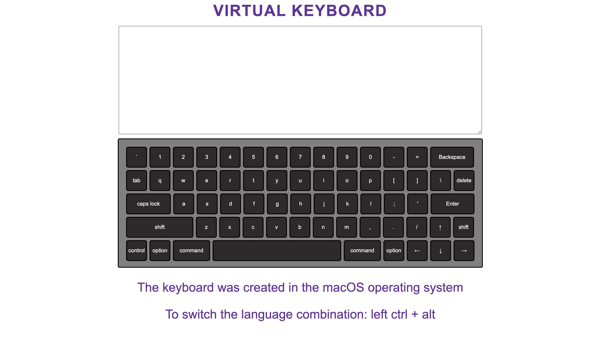

# virtual-keyboard

## 📝 Description

This project implements a virtual keyboard with the following features:

## Features
- Switch between two language layouts (English + Russian).
- Assign a keyboard shortcut for switching keyboard layout.
- Display symbols of the selected language on the virtual keyboard buttons.
- Save the chosen language after the page is reloaded.
- Display the keyboard in the selected language after reloading the page.
- Indicate the keyboard shortcut for changing language on the page.
- Animated keystrokes.
- Clicks on virtual keyboard buttons and pressing keys on a physical keyboard input symbols to the text area above the virtual keyboard.
- Pressing the Up, Down, Left, or Right arrow key inputs an arrow symbol or implements navigation in the text area.
- Pressing Enter moves the text cursor to the next line.
- Pressing Tab creates a horizontal indent.
- Pressing the rest of the function keys does not result in inputting symbols.
- Backspace removes the character before the text cursor.
- Del removes the character after the text cursor.
- Shift, Alt, Ctrl, Caps lock, and Space keys work as on a real keyboard.

## 🛠️ Technology Stack

- JS 
- HTML
- CSS
- ESLint 
- SASS

### `start` ▶️

Open [https://papryca.github.io/virtual-keyboard/](https://papryca.github.io/virtual-keyboard/) to view it in the browser.

## 🚀 Getting Started

To set up and run the project locally, follow these steps:

1. Clone the repository: `git clone git@github.com:papryca/virtual-keyboard.git`
2. Navigate to the project directory: `cd virtual-keyboard`
3. Install dependencies: `npm install`
4. Start the development server: `run index.html`

The application will open in your default browser, allowing you to explore and interact with it.

## Screenshot

